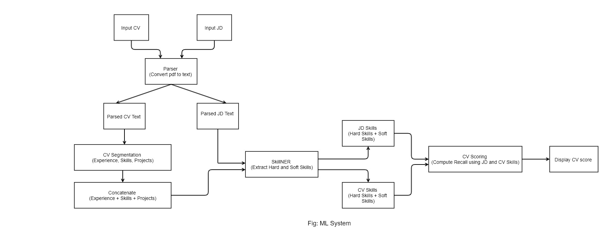

# CV Scoring

CV scoring is an app that scores the CV/Resume based on the Job Descriptions. If the CV matches with the Job Descriptions then score will be high and for unmatched CV score will be low. In the first version of CV scoring Recall is used for generating score based on CV and JD (job descriptions). For perfectly matched Recall score will be 1 and for perfectly unmatched recall score will be 0. In General Recall score is in between 0 to 1. The overall pipeline is as shown:  

**Steps:**

- Input JD(pdf) and CV(pdf)
- Parser (fitz): Convert pdf to text
- CV Segmentation: Extract experience, skills, projects
- Concatenate: concatenate extracted experience, skills, projects
- Pass parsed JD text and CV to SkillNER (extract Hard and SOft Skills)
- Compute Recall score (based on extracted hard and soft skills)
- Display CV score

**Demo:**  [click_here](https://share.streamlit.io/thapaliya123/cv-scoring/streamlit_recall_scoring.py)

## Instruction for Running
- git clone [git url]
- pip install -r requirements.txt
    - If error on installing certain module, simply remove version (e.g. `pandas==1.3.4` to `pandas`)
    - **Scikit-learn** should be of version `scikit-learn==0.24.2`
- streamlit run streamlit_recall_scoring.py
 